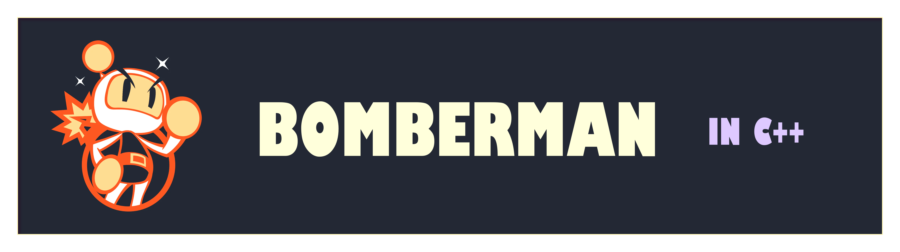

---
The Bomberman game in C++, without use of SFML library.

**Note: This game is developed using basic knowledge of C++ and a few select advanced methodologies that are documented.**

## Description
Bomberman Clone is a grid-based arcade game where the player strategically places bombs to destroy obstacles and defeat enemies. The game involves elements of timing, strategy, and survival. The player must avoid enemies and explosions while aiming to clear all enemies to win.

This is not a meant to be a direct copy, rather a re-imagining of the game in a different development environment.

## Gameplay
**Fundamentally: Player vs. Enemies and Obstacles**

1. The game field is divided into a **grid** of rows and columns, represented by a 2D array.
2. The player represented by **green box** starts at a fixed position on the grid.
3. Enemies represented by **purple boxes** are placed randomly in the grid.
4. Bombs placed by the player are represented by a **phasing red box** in the grid.
5. The bomb explodes after a 3-second timer, clearing destructible obstacles and damaging enemies.
6. The bomb's explosion radius extends horizontally and vertically, marking its path temporarily as red boxes.
7. Obstacles represented by blue box have to be cleared in order to find the gate.
8. The gate represented by letter 'I' is where the player enters after clearing the enemies from the grid.
9. The walls represented by grey boxes are indestructible and have to be traversed around.
10. The player can get more abilities by acquiring power-ups represented by letter '+'.
11. The game features multiple stages, with every stage having increased difficulty.

## Features
### Player Movement
   - The player moves using arrow keys.
   - The movement of player has a speed limited by its stamina.
     - The stamina is represented by the letter '+'.
     - Stamina can be increased by power-ups.

### Bomb Placement
   - Bombs are placed at the player's position and detonate after a fixed delay.
   - Bomb explosions clear destructible obstacles and damage enemies.
   - Multiple bomb placement ability and special bombs can be acquired by power-ups.
     - Mobile bomb: This bomb when kicked by the player slides in the direction until it hits an obstacle.
     - Jumping bomb: The player can flung the bomb across a single obstacle.
     - Controlled bomb: This bomb can be detonated before its timer by a key press.

### Enemy 
   - Enemies move in a random direction at a fixed speed.
   - Enemy movement speed increases with difficulty.
   - Special enemies can chase player and go through obstacles.

### Power-ups
   - Every stage features a set number of power-ups.
   - Power-ups are acquired in three ways:
     - Catching the letter '+' in the grid.
     - Defeating special enemies.
     - Destroying obstacles hiding power-ups.

### Win and Lose Conditions
   - The player has to eliminate all enemies in the grid.
   - The player has to then find the gate hidden within the obstacles.
   - The player loses if caught in an explosion or collides with an enemy.
   - The player wins the stage if it goes through the gate after eliminating enemies.

### Score
   - The game keep tracks of scores acquired by the player.
     - Defeating an enemy gives 5 score.
     - Getting a power-up gives 1 score.
     - Winning the stage gives 10 score.
   - Top scores are stored locally in a file.

### Sound (pending)
   - The game features sound effects for various events.
   - Sounds can be muted in the Main Menu.

### Stages
   - The game will have a fixed number of stages.

## Other features
1. Multiplayer mode: The game will allow two players to play at the same time.
2. Timer: The game keeps track of time for speed-runners.